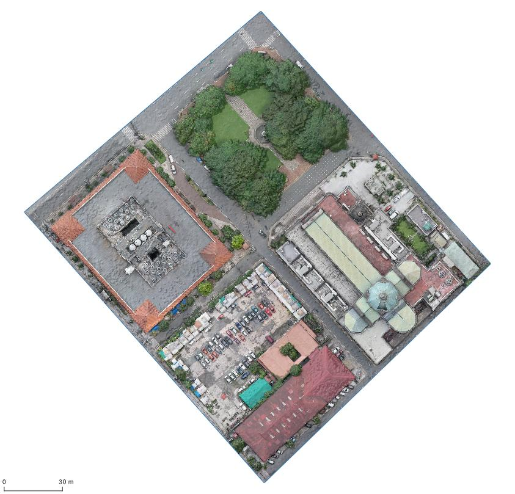
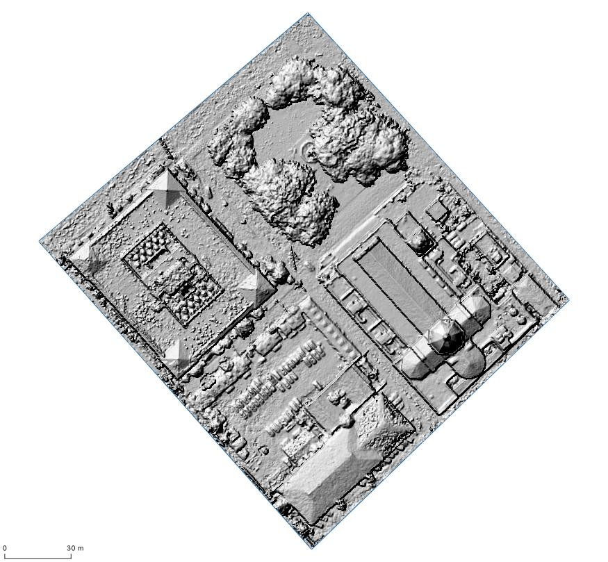
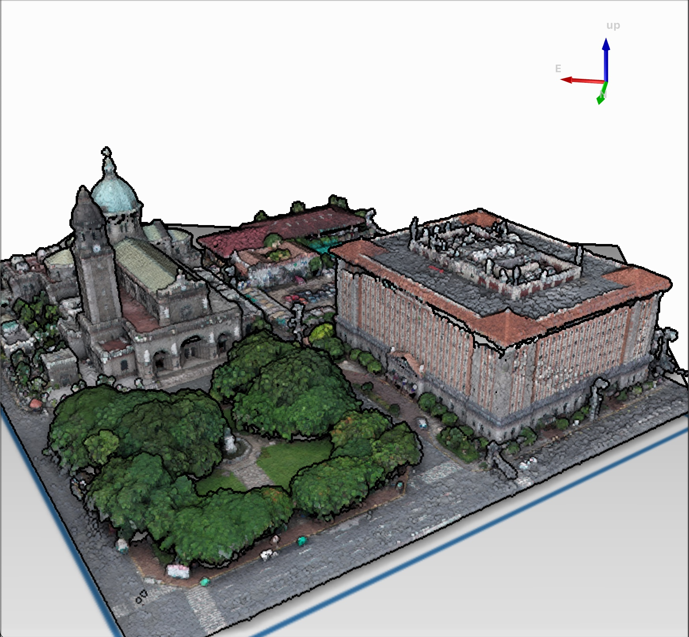

# plaza-roma-imagery

Plaza Roma data is a subset of Intramuros drone imagery data provided by [Datum PH](https://datum.ph/) to OpenStreetMap Philippines under the [2021 Drone Imagery Collection Grant by Datum & OSMph](https://wiki.openstreetmap.org/wiki/Philippines/2021_Drone_Imagery_Collection_Grant_by_Datum_%26_OSMph).

We are sharing this subset to allow anyone to explore and experiment with drone derived high resolution imagery for a small area.  Full dataset is available at [OpenAerialMap](https://map.openaerialmap.org/#/120.97864642739296,14.58711500168072,19/square/132303122000013300/635a05775f1fd800066121e2?resolution=high&_k=eixes5).

**Download each file from the following links.**

Orthophoto ([51MB](https://open-hazards-ph.s3.amazonaws.com/datum/plaza-roma/plaza_roma_ortho.tif.zip)) | Digital Surface Model ([15MB](https://open-hazards-ph.s3.amazonaws.com/datum/plaza-roma/plaza_roma_dsm.tif.zip)) | Point cloud ([111MB](https://open-hazards-ph.s3.amazonaws.com/datum/plaza-roma/plaza_roma.laz.zip))
--|--|--
|  |  

# License

Shield: [![CC BY 4.0][cc-by-shield]][cc-by]

This work is licensed under a
[Creative Commons Attribution 4.0 International License][cc-by].

[![CC BY 4.0][cc-by-image]][cc-by]

[cc-by]: http://creativecommons.org/licenses/by/4.0/
[cc-by-image]: https://i.creativecommons.org/l/by/4.0/88x31.png
[cc-by-shield]: https://img.shields.io/badge/License-CC%20BY%204.0-lightgrey.svg
